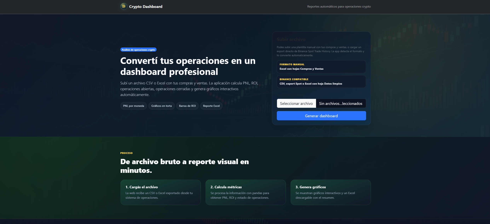

# Dashboard Web de Operaciones Cripto

Dashboard web para analizar operaciones de criptomonedas desde archivos CSV o Excel.

La aplicación procesa compras y ventas, calcula PNL, ROI, operaciones abiertas, operaciones cerradas y genera gráficos interactivos con detalle por moneda.

Proyecto creado con **Python, Flask, pandas, Plotly, Bootstrap, HTML, CSS y JavaScript**.

---

## Vista previa

<p align="center">
  
</p>

<p align="center">
  Interfaz principal para cargar operaciones y generar métricas, gráficos interactivos y reportes automáticos.
</p>

---


## Características

* Carga de archivos `.xlsx`, `.xls` y `.csv`.
* Lectura de reportes manuales con hojas `Compras` y `Ventas`.
* Detección de exports compatibles de Binance Spot Trade History.
* Conversión automática de operaciones de Binance al formato interno del dashboard.
* Cálculo de métricas principales:

  * Total invertido.
  * Total vendido.
  * PNL total realizado.
  * ROI total.
  * Operaciones abiertas.
  * Operaciones cerradas.
  * Resumen por moneda.
* Gráficos interactivos con Plotly:

  * Distribución del capital invertido por moneda.
  * PNL cerrado por moneda.
  * ROI porcentual por moneda.
  * Operaciones abiertas vs. cerradas.
  * Evolución del PNL acumulado.
* Detalle ampliado por moneda al hacer clic en gráficos o filas.
* Resumen automático de rendimiento:

  * Mejor trade.
  * Peor pérdida realizada.
  * Mejor moneda por PNL.
  * Moneda con peor rendimiento.
  * Win rate global.
  * Mejor ROI por moneda.
* Descarga de reporte Excel generado.
* Formulario de contacto para solicitar una versión personalizada.

---

## Vista general

La aplicación permite subir un archivo de operaciones y genera un dashboard con:

* Tarjetas de métricas generales.
* Gráficos interactivos.
* Tabla resumen por moneda.
* Panel de detalle por moneda con operaciones abiertas, cerradas y ventas.
* Botón para generar un resumen ejecutivo del rendimiento.

---

## Formatos soportados

### 1. Excel manual

El archivo puede incluir una hoja obligatoria llamada `Compras` y una hoja opcional llamada `Ventas`.

Columnas requeridas para la hoja `Compras`:

```txt
ID
Nombre
Fecha de compra
Dólares comprados
Precio de compra
Cantidad comprada
Cantidad vendida total
Cantidad restante
Estado
```

Columnas opcionales para la hoja `Ventas`:

```txt
ID venta
ID compra
Nombre
Fecha venta
Cantidad vendida
Precio venta
Dólares vendidos
Costo proporcional
PNL realizado
```

---

### 2. Export de Binance

También acepta archivos CSV o Excel exportados desde Binance Spot Trade History con columnas como:

```txt
Date(UTC)
Pair
Side
Price
Executed
Amount
```

La aplicación detecta este formato y convierte las operaciones al modelo interno de compras y ventas.

---

### 3. Reporte limpio

También puede trabajar con reportes previamente limpiados con columnas como:

```txt
Fecha
Par
Lado
Cantidad
Precio
Total_Cotizacion
```

---

## Instalación

### 1. Clonar el repositorio

```bash
git clone https://github.com/tu-usuario/crypto-dashboard-web.git
cd crypto-dashboard-web
```

### 2. Crear un entorno virtual

```bash
python -m venv .venv
```

### 3. Activar el entorno virtual

En Windows:

```bash
.venv\Scripts\activate
```

En macOS/Linux:

```bash
source .venv/bin/activate
```

### 4. Instalar dependencias

```bash
pip install -r requirements.txt
```

---

## Ejecutar el proyecto

```bash
python app.py
```

Luego abrir en el navegador:

```txt
http://127.0.0.1:5000
```

---

## Estructura del proyecto

```txt
crypto_dashboard_web/
├── app.py
├── requirements.txt
├── README.md
├── static/
│   ├── css/
│   │   └── style.css
│   ├── img/
│   │   ├── trading-dashboard-bg.png
│   │   └── trading-charts-bg.png
│   └── js/
│       ├── animations.js
│       ├── contact.js
│       └── dashboard-detail.js
├── templates/
│   ├── base.html
│   ├── dashboard.html
│   └── index.html
└── uploads/
    └── .gitkeep
```

---

## Tecnologías utilizadas

* Python
* Flask
* pandas
* openpyxl
* Plotly
* Bootstrap
* HTML
* CSS
* JavaScript

---

## Notas importantes

* Esta aplicación está pensada como dashboard local/demo.
* Para producción se recomienda:

  * Cambiar la `SECRET_KEY`.
  * Desactivar `debug=True`.
  * Usar un servidor WSGI como Gunicorn, Waitress o uWSGI.
* Los archivos subidos se guardan en la carpeta `uploads/`.

---

## Autor

Creado por **Lucas Rimbano** para **tunegocioweb**.
